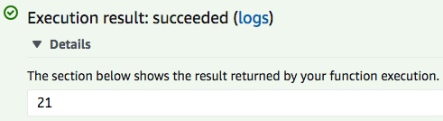

Cloud Computing

## 1. AWS Management Console

- Go to the [AWS Management Console](https://console.aws.amazon.com).

## 2. IAM Role

### Create an IAM role

* Create a role:
  * Go to the [create role](https://console.aws.amazon.com/iam/home?#/roles$new) page.
  * Select type of trusted entity: `AWS service`.
  * Choose the service that will use this role: `Lambda`.
  * Click the `Next: Permissions` button.
* Attach permissions policies:
  * Policy name: `AWSLambdaBasicExecutionRole`.
  * Click the `Next Tags` button.
* Add tags:
  * Enter the new key as `qtm385-lambda`.
  * Click the `Next: Review` button.
* Review
  * Role name: `qtm385-lambda`.
  * Click the `Create role` button.

### Create a policy

* Go to the [policies](https://console.aws.amazon.com/iam/home?#/policies) page.

* Click the `Create policy` button.

* Enter the following under `JSON`, and click the `Review policy` button.

* ```json
  {
      "Version": "2012-10-17",
      "Statement": [
          {
              "Effect": "Allow",
              "Action": "lambda:InvokeFunction",
              "Resource": "*"
          }
      ]
  }
  ```

* Review policy:

  * Name: `LambdaInvokeFunction`.
  * Click the `Create policy` button.

### Attach a policy

* Go to the [roles](https://console.aws.amazon.com/iam/home?#/roles) page.

* Click the `qtm385-lambda` role.

* Under `Permissions`:

  * Click the `Attach policies` button.
  * Policy name: `LambdaInvokeFunction`.
  * Click the `Attach policy` button.

* Under `Trust relationships`:

  * Click the `Edit trust relationship` button.

  * Update the policy as follows:

  * ```json
    {
      "Version": "2012-10-17",
      "Statement": [
        {
          "Sid": "",
          "Effect": "Allow",
          "Principal": {
            "Service": [
              "lambda.amazonaws.com",
              "apigateway.amazonaws.com"
            ]
          },
          "Action": "sts:AssumeRole"
        }
      ]
    }
    ```

## 3. AWS Lambda

### Create a function

* Go to the [AWS Lambda](https://console.aws.amazon.com/lambda) page.
* Make sure your region is `US East (N. Virginia)`.
* Click the `Create a function` button.
* Option: `Author from scratch`.
* Function name: `sum`.
* Runtime: `Python 3.6`.
* Permissions
  * Choose or create an execution role: `Use an existing role`.
  * Existing role: `qtm385-lambda`.
* Click the `Create function` button.

### Function code

* Code entry type: `Edit code inline`.

* Runtime: `Python 3.6`.

* Handler: `lambda_function.lambda_handler`.

* Update `lambda_function.py` as follows:

* ```python
  def sum_handler(event, context):
      a = event['a']
      b = event['b']
      c = a + b
      return c
  ```

* Click the `Save` button.

* Click `Select a test event` and create a new test event called `sumAB`:

* ```json
  {
    "a": 1,
    "b": 2
  }
  ```

* Click the `Test` button.

* If you see the following message, your lambda function ran successfully.

  

### API Gateway

* Click `API Gateway`.

* API: `Create a new API`.

* Security: `Open`.

* API name: `sum-API`.

* Click the `Add` button and then the `Save` button.

* Click `sum-API`.

* Delete the `ANY` method.

* Create a `GET` method.

  * Lambda Funcation: `sum`.

* Click the `Save` button.

* Under the `GET` method execution,  click `Intergration Requests`.

* Expand `Mapping Templates`:

  * Click `Add mapping template`.

  * Content-Type: `application/json`.

  * Click the `Yes, secure this integration` button.

  * ```json
    {
        "a": $input.params('a'),
        "b": $input.params('b')
    }
    ```

  * Click the `Save` button.

* Click `Diploy API`:

  * Deployment stage: `prop`.
  * Click the `Deploy` button.

* Click the invoke URL with the parameters `a` and `b`:

  * `https://xxxxxxxxxx.execute-api.us-east-1.amazonaws.com/prod?a=1&b=2`

* If you see `3`, your lambda function is successfully attached to the gateway.

### Test the lambda function

```python
import requests
import sys

url = 'https://xxxxxxxxxx.execute-api.us-east-1.amazonaws.com/prod/sum?a={}&b={}'
a = int(sys.argv[1])
b = int(sys.argv[2])
r = requests.get(url.format(a, b))
print(r.text)
```

