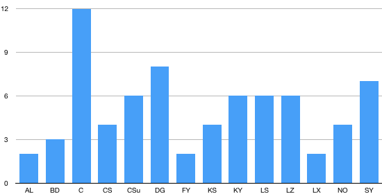

Final Projects
=====

## Spring 2019

* Devising a Text Classifier that Categorizes Bitcoin Related Articles by Subtopic to Analyze the Dynamics of Subtopic Trend
  * Sangkyun An, Seung Hyun Lim
  * [Abstract](https://drive.google.com/open?id=12GFvh9xsB2qYrg4umnOj0XjmjWD6HEr3), [Proposal](https://drive.google.com/open?id=1KFpPnRLZrYwlNLjChJiiPgUk9-I3G1vn) ([slides](https://drive.google.com/open?id=1YErA9u8OTaYI951XnJszn4MIAAd6sPY6)), [Final](https://drive.google.com/open?id=1YNMWJPOxFgtTd7Uk1GBq6qhs92GRoFfh) ([slides](https://drive.google.com/file/d/1b7j-Oypy1o3akNYv-ip9335biR0Zmv_q/view?usp=sharing))
* Treasure Trove: Unlocking the Mystery Behind the Russian Trolls
  * Abdul Bingahlan, Alisha Dhanani
  * [Abstract](https://drive.google.com/open?id=1jQUz-HA1AWlRs1hDd686wG_o2VupYzu0), [Proposal](https://drive.google.com/open?id=1myBddIdAcs6kH9x1ZdWKBJV1Xb1cG04I) ([slides](https://drive.google.com/open?id=17QrpkWQswi0d_zcVd4oCWSO-y2G-9aFr)), [Final](https://drive.google.com/open?id=1NCemwLFZQ9n3NDSsg73sl8hcPbIL27LA) ([slides](https://drive.google.com/file/d/1w7ccvXDL7Ys8ACALi5g_1zRzLd8yvMcy/view?usp=sharing))
* Top Tech Corporations' Core Competitiveness in Job Markets: Analysis of Employee Reviews
  * Kemin Cao
  * [Abstract](https://drive.google.com/open?id=1RTf88J5BQAPDdNOq8HoBX_XVPdYPLoKH), [Proposal](https://drive.google.com/open?id=13nW0ssv2-uMNX1bz2Deay3Ibk8u0AjEF) ([slides](https://drive.google.com/open?id=1vxOuXTQELFwwF_yVQ2ZSaH1QVgxJubkx)), Final ([slides](https://drive.google.com/open?id=1tYuTAqIWxldX7p3_qfYGqYIW5yzpDJbA))
* Taste and Variety Based Wine Rate Predicting Using Python
  * Jiheng Chen, Jolina Shen
  * [Abstract](https://drive.google.com/open?id=1MVOZodA398bd-K2p6wcGj_BseScyGj1F), [Proposal](https://drive.google.com/open?id=1pJxQT15myMmTUD51O1Yh7_cEQ8XLhlpI) ([slides](https://drive.google.com/open?id=1PtCXIPK9Rukx9ftIG8OTDVjCtjJ4c73b)), [Final](https://drive.google.com/open?id=1aE3VtF_GArdv9NwVBTHWMAMi135FrxZw) ([slides](https://drive.google.com/open?id=1WhiOVVfDY630lIsgg2WQ5hVofojHPQLV))
* Analyzing Gender Bias in Youtube Science Community
  * Xiaoyi Chen, Seraph (Yingliang) Sun
  * [Abstract](https://drive.google.com/open?id=1jttavgZMbcvFRhKvFEd6a8mnzAYBRBB-), [Proposal](https://drive.google.com/open?id=1AjL8Z-WIeO6Z713V07ITKrMg5wxxmGqr) ([slides](https://drive.google.com/open?id=16hmPNz7mryKzMkMU1ux7qfnPaE0iBzs-)), [Final](https://drive.google.com/open?id=1RHdyaZvSvLs14zQUBiBHUcSUwqd8JEl2) ([slides](https://drive.google.com/open?id=1IOnwUqOZ-Akq6Uk68CjW-xJo-H2mQ0if))
* The Changing Landscape of Computer Science Related Jobs
  * Haozhe Du, Haoqi Gu
  * [Abstract](https://drive.google.com/open?id=1-VisxLLdfu3eK9cZoggwo-eH92BjR1Na), [Proposal](https://drive.google.com/open?id=13vFWW5ChTbJFKJl6OCEDTFldje8Xixdy) ([slides](https://drive.google.com/open?id=16RSJ3D7y75GcUqRNWtcYMbH5WJc9Ei4w)), [Final](https://drive.google.com/open?id=1ceMEfO72luZgueTtX3Z7rs7iGZr-HFEp) ([slides](https://drive.google.com/open?id=1AHf53cwHhW21gYrqdkwcPsgyfBDSodD7))
* Revenue Analysis: Analyzing Google Merchandise Store and its Yelp Review
  * Frank Fu, Angelina You
  * [Abstract](https://drive.google.com/open?id=1itqajMVwGBPNSV5bqEr6iiAF3A0jd7f2), [Proposal](https://drive.google.com/open?id=1uQm_Uzm46LqtYwQG2DqAUbgoSlO2U2wg) ([slides](https://drive.google.com/open?id=1Am4FsX7p1nxWMrUbITt9zm_dTcrQIiMu)), [Final](https://drive.google.com/open?id=1_3Fmpo6TMGpuFctrFsQhLudWWff62ofy) ([slides](https://drive.google.com/open?id=1xxRdQ40rZig2xL2hqLUKmV_c5wwUIer1))
* Visualizing the Filmography of Hollywood Stars: Classifying the Oscar Actors
  * Justin Kim, Eunsung Shin
  * [Abstract](https://drive.google.com/open?id=1-HHr3Pmy3lzR51GtiPaAIlCVoBl3MPgE), [Proposal](https://drive.google.com/open?id=1D6vQMW_JZ5iHst_4ggRNt2Up14Qsg2Sc) ([slides](https://drive.google.com/open?id=1p3FDwWStxAV_isYmo-NqFK8yKUxTLdRU)), [Final](https://drive.google.com/open?id=1ZezR7cA4DeMlwbtCUCUnh_Sq-T6yuGAU) ([slides](https://drive.google.com/file/d/1modiLUdlyDdbfqaBbf570fkHEiyJfS8t/view?usp=sharing))
* Instruction on Building a Successful Game App +11
  * Lisa Kuai, Francis Yin
  * [Abstract](https://drive.google.com/open?id=1CRdbVeUpM0XnKdsMSFFOO9cafM0RFwBQ), [Proposal](https://drive.google.com/open?id=1Mek9gnuszS6WaDRsWuje8HYPlllGi3wz) ([slides](https://drive.google.com/open?id=1dbIrJ9VBARy2hLSHkHOJRRtqXkzM6xYu)), [Final](https://drive.google.com/open?id=1XmoOj6_wAvwAlcK4e1bSTSSZOBsPXRK_) ([slides](https://drive.google.com/open?id=1cvn8_yrefyNwlsw-mr6EMpnG2o__tXqr))
* Assessing the Impact of New York Times News Articles on IPO Prices
  * Chloe Lee, Kelsey Sattler
  * [Abstract](https://drive.google.com/open?id=1Xnhkc7FhzT6Kdu47awUlPJOaXvVF9CkK), [Proposal](https://drive.google.com/open?id=1jNqEt28W-jB_KXChGqymUMLBQMUOk766) ([slides](https://drive.google.com/open?id=15aSUV1zlREE91cENFJF6OgL-An-igtQe)), [Final](https://drive.google.com/open?id=1boGJexrEeRQiNlwP8iCBWfZf0gnjlOCB) ([slides](https://drive.google.com/open?id=1KKkRXmARL2N1Ii_kX-pvP_yNkLpN8-Du))
* Can Tripadvisor Decide the Fate of a Business? +8
  * Jiayin Li, Ningduo Zhao
  * [Abstract](https://drive.google.com/open?id=1BKYJncT2G0w3nWly7l3iJFVn9CmP-CKl), [Proposal](https://drive.google.com/open?id=1-bme_l7dp3t8nc7BFjWyawCwa_H94aWb) ([slides](https://drive.google.com/open?id=1D9QN28Alc3lDdbln5Oh2Yq4NYEeensVS)), [Final](https://drive.google.com/open?id=1XOFfvyl-aRnRtPIns62-ixorNHRXVdQv) ([slides](https://drive.google.com/file/d/13mAZzEknfE5ydSmeN57keWLVdPtqUnVN/view?usp=sharing))
* Using Topic Modeling to Explain Movements in ETF
  * Qiao Lin, Tian Xia
  * [Abstract](https://drive.google.com/open?id=1tjR96NkzNlu0Ggegf_xYmQ42R44FWWNi), [Proposal](https://drive.google.com/file/d/1nuN9W6rEyi0dts6D1ht5zLnal2yDj81k/view?usp=sharing) ([slides](https://drive.google.com/file/d/1H5ccgkigchgsnDWFJM_UF4WW3v08ChAN/view?usp=sharing)), [Final](https://drive.google.com/open?id=1cUExrjGtQWcbJ4I965YXTES4u7W1D607) ([slides](https://drive.google.com/file/d/1Py2h2hiOOqHWytcRj2To95gGShTYrScl/view?usp=sharing))
* Broadening Horizons: A Sentiment Analysis of Music Reviews +1
  * Jake Nachlas, Matt Organisak
  * [Abstract](https://drive.google.com/open?id=13aYgY-6Qod8ybMRxj7F9Gry3NQndSR7u), [Proposal](https://drive.google.com/open?id=1pf4IBlhvCHfBcxOqlunagVAiEVy2O53c) ([slides](https://drive.google.com/open?id=1Kigom90ED63BH9WyMdZ_GQwAGT8MYahM)), [Final](https://drive.google.com/open?id=1yaxc-JLLqw6iGiExTxusK9Ai4R8Gp3u-) ([slides](https://drive.google.com/open?id=1S0uyje3sE812eOvpV7c37bwmCWiYLgJw))
* Emory Professors Review Scores Distribution on RateMyProfessors.com +10
  * Colleen Su, Derick Yang
  * [Abstract](https://drive.google.com/open?id=1RcaOA46olr7T8MRlJq9UKNk_p3BGFwSu), [Proposal](https://drive.google.com/open?id=1qAGKTT6Nw2TSpYIrqPVF7ujvwaBF4Zxo) ([slides](https://drive.google.com/open?id=1d4PbZYKsZIIuVlIEgsU2YYIugUT33AFK)), [Final](https://drive.google.com/open?id=1WxZk3MoyPVmG6WWEzl6Q55C964Vy4hu5) ([slides](https://drive.google.com/open?id=1vZWbanMGVpmISvwwfNGKn2Y9ez_ty2Vj))

## Proposal Ranking
 

## Final Ranking
 

