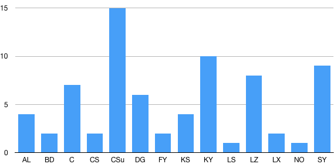

Final Projects
=====

## Spring 2019

* Devising a Text Classifier that Categorizes Bitcoin Related Articles by Subtopic to Analyze the Dynamics of Subtopic Trend +4
  * Sangkyun An, Seung Hyun Lim
  * [Abstract](https://drive.google.com/open?id=12GFvh9xsB2qYrg4umnOj0XjmjWD6HEr3), [Proposal](https://drive.google.com/open?id=1KFpPnRLZrYwlNLjChJiiPgUk9-I3G1vn) ([slides](https://drive.google.com/open?id=1YErA9u8OTaYI951XnJszn4MIAAd6sPY6)), Paper (slides)
* Treasure Trove: Unlocking the Mystery Behind the Russian Trolls +2
  * Abdul Bingahlan, Alisha Dhanani
  * [Abstract](https://drive.google.com/open?id=1jQUz-HA1AWlRs1hDd686wG_o2VupYzu0), [Proposal](https://drive.google.com/open?id=1myBddIdAcs6kH9x1ZdWKBJV1Xb1cG04I) ([slides](https://drive.google.com/open?id=17QrpkWQswi0d_zcVd4oCWSO-y2G-9aFr)), Paper (slides)
* Top Tech Corporations' Core Competitiveness in Job Markets: Analysis of Employee Reviews +7
  * Kemin Cao
  * [Abstract](https://drive.google.com/open?id=1RTf88J5BQAPDdNOq8HoBX_XVPdYPLoKH), [Proposal](https://drive.google.com/open?id=13nW0ssv2-uMNX1bz2Deay3Ibk8u0AjEF) ([slides](https://drive.google.com/open?id=1vxOuXTQELFwwF_yVQ2ZSaH1QVgxJubkx)), Paper (slides)
* Find the Right Wine on CellarTracker Red Wine Website using Python Wine Rate Predicting for Various Taste Preference +2
  * Jiheng Chen, Jolina Shen
  * [Abstract](https://drive.google.com/open?id=1MVOZodA398bd-K2p6wcGj_BseScyGj1F), [Proposal](https://drive.google.com/open?id=1pJxQT15myMmTUD51O1Yh7_cEQ8XLhlpI) ([slides](https://drive.google.com/open?id=1PtCXIPK9Rukx9ftIG8OTDVjCtjJ4c73b)), Paper (slides)
* Analyzing Gender Bias in Youtube Science Community +15
  * Xiaoyi Chen, Seraph (Yingliang) Sun
  * [Abstract](https://drive.google.com/open?id=1jttavgZMbcvFRhKvFEd6a8mnzAYBRBB-), [Proposal](https://drive.google.com/open?id=1AjL8Z-WIeO6Z713V07ITKrMg5wxxmGqr) ([slides](https://drive.google.com/open?id=16hmPNz7mryKzMkMU1ux7qfnPaE0iBzs-)), Paper (slides)
* The Changing Landscape of Job Market in the U.S. +6
  * Haozhe Du, Haoqi Gu
  * [Abstract](https://drive.google.com/open?id=1-VisxLLdfu3eK9cZoggwo-eH92BjR1Na), [Proposal](https://drive.google.com/open?id=13vFWW5ChTbJFKJl6OCEDTFldje8Xixdy) ([slides](https://drive.google.com/open?id=16RSJ3D7y75GcUqRNWtcYMbH5WJc9Ei4w)), Paper (slides)
* Predicting Revenue through Google Analytics 360: Quantitative Analysis of Google Merchandise Store +2
  * Frank Fu, Angelina You
  * [Abstract](https://drive.google.com/open?id=1itqajMVwGBPNSV5bqEr6iiAF3A0jd7f2), [Proposal](https://drive.google.com/open?id=1uQm_Uzm46LqtYwQG2DqAUbgoSlO2U2wg) ([slides](https://drive.google.com/open?id=1Am4FsX7p1nxWMrUbITt9zm_dTcrQIiMu)), Paper (slides)
* Visualizing the Filmography of Hollywood Stars
  * Justin Kim, Eunsung Shin
  * [Abstract](https://drive.google.com/open?id=1-HHr3Pmy3lzR51GtiPaAIlCVoBl3MPgE), [Proposal](https://drive.google.com/open?id=1D6vQMW_JZ5iHst_4ggRNt2Up14Qsg2Sc) ([slides](https://drive.google.com/open?id=1p3FDwWStxAV_isYmo-NqFK8yKUxTLdRU)), Paper (slides)
* Instruction on Building a Successful Game App
  * Lisa Kuai, Francis Yin
  * [Abstract](https://drive.google.com/open?id=1CRdbVeUpM0XnKdsMSFFOO9cafM0RFwBQ), [Proposal](https://drive.google.com/open?id=1Mek9gnuszS6WaDRsWuje8HYPlllGi3wz) ([slides](https://drive.google.com/open?id=1dbIrJ9VBARy2hLSHkHOJRRtqXkzM6xYu)), Paper (slides)
* Assessing the Impact of New York Times News Articles With Respect to the Application of Benford's Law on IPO Prices in the United States Financial Market
  * Chloe Lee, Kelsey Sattler
  * [Abstract](https://drive.google.com/open?id=1Xnhkc7FhzT6Kdu47awUlPJOaXvVF9CkK), [Proposal](https://drive.google.com/open?id=1jNqEt28W-jB_KXChGqymUMLBQMUOk766) ([slides](https://drive.google.com/open?id=15aSUV1zlREE91cENFJF6OgL-An-igtQe)), Paper (slides)
* Can Tripadvisor Decide the Fate of a Business?
  * Jiayin Li, Ningduo Zhao
  * [Abstract](https://drive.google.com/open?id=1BKYJncT2G0w3nWly7l3iJFVn9CmP-CKl), [Proposal](https://drive.google.com/open?id=1-bme_l7dp3t8nc7BFjWyawCwa_H94aWb) ([slides](https://drive.google.com/open?id=1D9QN28Alc3lDdbln5Oh2Yq4NYEeensVS)), Paper (slides)
* Using NLP Methods to Identify Connection Between Movie Subreddits and the Stock Market
  * Qiao Lin, Tian Xia
  * [Abstract](https://drive.google.com/open?id=1tjR96NkzNlu0Ggegf_xYmQ42R44FWWNi), [Proposal](https://drive.google.com/file/d/1nuN9W6rEyi0dts6D1ht5zLnal2yDj81k/view?usp=sharing) (slides), Paper (slides)
* Broadening Horizons: A Sentiment Analysis of Music Reviews
  * Jake Nachlas, Matt Organisak
  * [Abstract](https://drive.google.com/open?id=13aYgY-6Qod8ybMRxj7F9Gry3NQndSR7u), [Proposal](https://drive.google.com/open?id=1pf4IBlhvCHfBcxOqlunagVAiEVy2O53c) ([slides](https://drive.google.com/open?id=1Kigom90ED63BH9WyMdZ_GQwAGT8MYahM)), Paper (slides)
* Emory Professors Review Scores Distribution on RateMyProfessors.com
  * Colleen Su, Derick Yang
  * [Abstract](https://drive.google.com/open?id=1RcaOA46olr7T8MRlJq9UKNk_p3BGFwSu), [Proposal](https://drive.google.com/open?id=1qAGKTT6Nw2TSpYIrqPVF7ujvwaBF4Zxo) ([slides](https://drive.google.com/open?id=1d4PbZYKsZIIuVlIEgsU2YYIugUT33AFK)), Paper (slides)

## Proposal Ranking

Ranking is provided by students from the course. 
  

